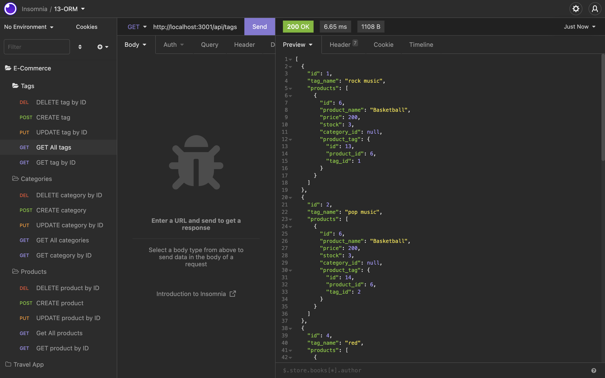

# e-commerce

## Table of Contents 
1. [Description](#description)
2. [Usage](#usage)
3. [Visuals](#visuals)
4. [Resources](#resources)

## Author:

Safwan Islam

## Description
In this challenge, there is code which builds out a e-commerce back-end database. The code builds out a template which is then used in the application Insomnia. There are three different sections, tags, categories, and products. Each of those has 5 API methods. These methods are DELETE by ID, CREATE, UPDATE by ID, GET All, and GET by ID. The picture in the visuals section is one which shows the "Get all tags" and its resulting data in Insomnia as an example, with a link to a video in the resources section which shows the complete functionality. Overall, this is an efficient way to manipulate back-end data for internet shoppers.

## Usage
In order to start this code, the user should first run "mysql -u root" in order to get into the mysql framework, then run "source db/schema.sql" then "exit" in order to run the database. Then the user should run "npm init -y" in order to initialize all dependencies followed by "npm install mysql2 express sequelize dotenv" in order install everything needed. Then the use should run "npm run seed". Then the user should run "nodemon" to start running the application and then check all routes in insomnia. 

## Visuals

## Resources
[Video Link](https://drive.google.com/file/d/1Ejf4TCNBDn0NEBRymmYtPe0Epv6roCSQ/view)

[GitHub Repository](https://github.com/saislam10/e-commerce)
